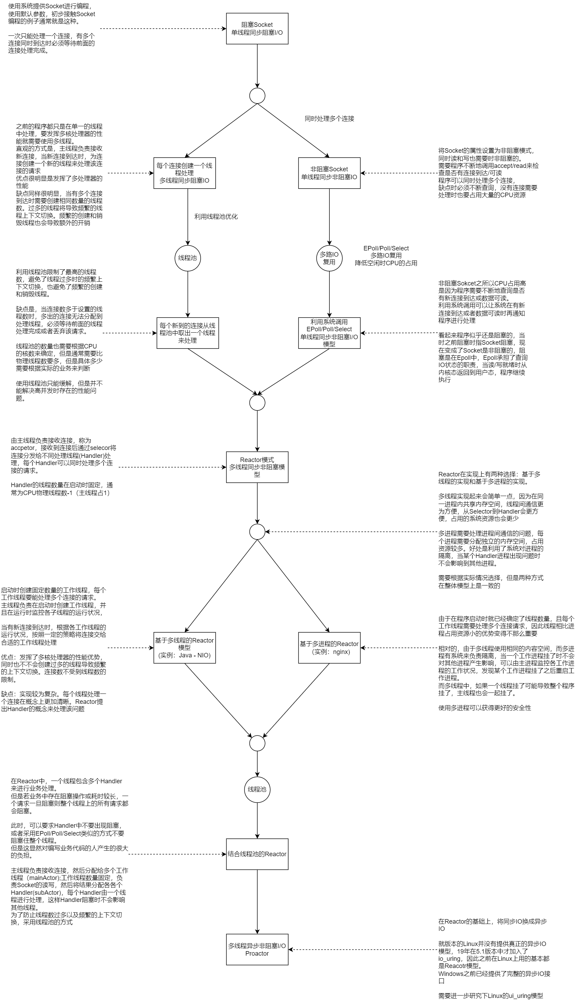

# 网络IO模型的个人梳理



上图梳理了个人对网络IO模型发展的认识，从最简单的单线程阻塞IO模型然后一步步完善功能发展到Reactor模型以及Proactor模型。个人理解这些模型模型并不是一蹴而就的，通过梳理可以了解到不同模型之间的差异，存在什么缺陷以及为了解决这些缺陷提出了什么方法而演进到下一个模型。

从模型的名字可以看到，这些模型主要在三个方向的组合：单线程还是多线程，同步还是异步，阻塞还是非阻塞。其中同步还是异步等到最后才来处理，在前面的模型的组合就是是否单线程和是否阻塞的组合，即：
1. 单线程同步阻塞IO(STSB Single Thread Synchronization Blocking IO)
2. 多线程同步阻塞IO(MTSB Multi Thread Synchronization Blocking IO)
3. 单线程同步非阻塞IO(STTN Single Thread Synchronization Non-blocking IO)
4. 多线程同步非阻塞IO(MTSN Multi Thread Synchronization Non-blocking IO)

在解决了以上问题之后，才提出了基于异步IO的多线程异步非阻塞IO(MTAN Mutil Thread Asynchronization Non-blocking IO)。

从整体的模型上看是这五类IO模型，到了具体的实现层面需要根据不同的场景进行优化，加入线程池和多路IO复用，以及选择基于线程的实现方案还是基于进程的实现方案衍生出了不同的实现方式

多线程同步非阻塞IO有两种实现方式：基于多线程的方案和基于多进程的方案。两个方案的优劣比较实际上是线程和进程之间优劣的比较。
线程相比于进程的开销较小的优点在此场景下其实并没有太大的优势：因为非阻塞IO（即基于epoll的事件驱动）时程序要创建的线程数/进程数在最开始就确定了，只有在主进程发现子进程故障或配置更新时才需要创建新的进程。
而进程利用操作系统的隔离带来的安全性则是较大的优势——在一个工作进程内发送的错误不会影响到其他进程
但是线程间可以方便的共享数据，而进程间要共享数据就很麻烦。最近Cloudflare说要用Rust重写一个类似Nginx的应用的理由就是基于此——Cloudflare需要重用连接，而nginx的连接池是每个工作进程独立的，不同进程间无法共用；改为采用多线程的实现方式可以共用一个连接池。而多线程带来的安全问题可以利用Rust的特性在很大的程度上避免
使用多进程还是多线程实现还是要根据具体的应用选择，毕竟很多场景其实并不会达到Cloudflare那么高的要求的。

## 单线程同步阻塞IO

单线程同步阻塞IO模型是最简单的，使用系统默认提供的Socket即可实现
```C++
int main(){
    /* 创建了一个使用TCP协议的socket, 由于TCP是面向连接的,所以socket类型
       为SOCK_STREAM, 若要使用UDP则需要使用SOCK_DGRAM. 
       AF_INET指定地址是IPv4的地址,IPv6需要改为AF_INET6  */
    int listen_fd = socket(AF_INET, SOCK_STREAM, IPPROTO_TCP);
    if(listen_fd == -1)
    {
        std::cerr << "Error: init socket failed! err[" << errno << "]: " << strerror(errno) << std::endl;
        return -1;
    }
    // addr用来指定要监听的具体地址
    struct sockaddr_in addr;
    // IPv4, 创建socket时已经指定为AF_INET, 这里的应该保持一直
    addr.sin_family = AF_INET;
    // TCP/IP的地址有IP:port组合确定,需要指定监听哪个端口
    // 使用htons将主机字节序转换为网络字节序, 主机字节序和网络字节序不同,永远都不要假设两者相同
    addr.sin_port = htons(8080);
    // Address to accept any incoming messages. 
    addr.sin_addr.s_addr = INADDR_ANY;
    // 设置好要监听的地址参数后, 调用bind绑定到socket上
    if(bind(listen_fd, (struct sockaddr*)&addr, sizeof(addr)) == -1)
    {
        std::cerr << "Error: bind socket failed! err[" << errno << "]" << strerror(errno) << std::endl;
        return -1;
    }
    // 确定要要监听的地址后,就可以其中监听
    if(listen(listen_fd, 16) == -1)
    {
        std::cerr << "Error: listen failed! err[" << errno << "]" << strerror(errno) << std::endl;
        return -1;
    }

    int conn = 0;
    char client_ip[INET_ADDRSTRLEN] = "";
    struct sockaddr_in client_addr;
    socklen_t client_addr_len = sizeof(client_addr);
    
    while (true)
    {
        std::cout << "listen..." << std::endl;
        // 由于没有将socket设置为非阻塞,因此accept会阻塞直到有一个连接到来
        conn = accept(listen_fd, (struct sockaddr*)&client_addr, &client_addr_len);
        // conn是新的连接到来时,有系统为该连接自动创建的socket所对应的描述符
        if(conn < 0)
        {
            std::cerr << "accept error" << std::endl;
            continue;
        }
        // 类似的,需要将网络字节序转换为主机字节序
        inet_ntop(AF_INET, &client_addr.sin_addr, client_ip, INET_ADDRSTRLEN);
        std::cout << "... connect " << client_ip << ":" << ntohs(client_addr.sin_port) << std::endl;

        char buf[256];
        // 在建立起新的连接后,开始进行通信,直到客户端主动断开连接或者处理完成有服务端断开连接
        while (true)
        {
            memset(buf, 0, sizeof(buf));
            // 简单期间,使用recv读取数据
            int len = recv(conn, buf, sizeof(buf), 0);
            // 正常情况下,recv会阻塞直到有收到client发来的数据才会返回,否则意味这通信出现了问题
            if(len == 0)
            {
                std::cout << "client close connect" << std::endl;
                break;
            }
            else if(len < 0)
            {
                std::cerr << "socket error : " << len << " client_ip " << client_ip << ":" << ntohs(client_addr.sin_port) << std::endl;
                break;
            }
            else
            {
                // 处理读取到的数据, 这里假设了收到的包每次都是一行的数据才能这样处理, 
                // 在实际环境下，不应假设每个包都包含了完整的一行数据，需要设置缓冲区读取
                if(strcmp(buf, "quit") == 0 || strcmp(buf, "quit\n") == 0 || strcmp(buf, "quit\r\n") == 0)
                {
                    std::cout << "close connect, " << " client_ip " << client_ip << ":" << ntohs(client_addr.sin_port) << std::endl;
                    break;
                }
                else
                {
                    std::cout << buf << std::endl;
                }
            }
        }

        close(conn);        
    }
    
    close(listen_fd);

    return 0;
}
```

缺点是明显的也是致命的：一次只能处理一个连接的请求

## 单线程同步非阻塞IO

为了解决单线程同步阻塞一次只能处理一个连接的请求的问题，可以将Socket设置非阻塞的。
设置成非阻塞的后，`accept`和`recv`都会立即返回。

```C++
SOCKET_TYPE createAndListenTcpSocket(int port, int max_wait_socket, int type)
{
    /************************************************************************
     * int  socket(int protofamily, int type, int protocol);    //返回sockfd
     * @param protofamily 协议域，常用的协议域有：AF_INET(IPV4)、AF_INET6(IPV6)、
     *  AF_LOCAL（或称AF_UNIX，Unix域socket）、AF_ROUTE... 
     *  协议域定义了socket的地址类型，在通信中必须采用对应的地址，在socket.h中定义
     * @param type socket类型，常用类型：SOCK_STREAM、SOCK_DGRAM、SOCK_RAW、
     *  SOCK_PACKET、SOCK_SEQPACKET... 在socket_type.h中定义
     * @param protocol 协议，IPPROTO_TCP、IPPTOTO_UDP、
     *  IPPROTO_SCTP、IPPROTO_TIPC， 为0时自动选择type类型对应的默认协议
     * type 和protocol不能随意组合
     * @return sockfd socket描述符
     * 以下代码创建了一个TCP连接的sockfd
    *************************************************************************/
    int listen_fd = socket(AF_INET, type, IPPROTO_TCP);
    if(listen_fd == -1)
    {
        std::cerr << "Error: init socket failed! err[" << errno << "]: " << strerror(errno) << std::endl;
        return -1;
    }

    struct sockaddr_in addr;
    // IPv4
    addr.sin_family = AF_INET;
    // 转换为网络字节序
    addr.sin_port = htons(port);
    // Address to accept any incoming messages. 
    addr.sin_addr.s_addr = INADDR_ANY;

    if(bind(listen_fd, (struct sockaddr*)&addr, sizeof(addr)) == -1)
    {
        std::cerr << "Error: bind socket failed! err[" << errno << "]" << strerror(errno) << std::endl;
        return -1;
    }

    if(listen(listen_fd, max_wait_socket) == -1)
    {
        std::cerr << "Error: listen failed! err[" << errno << "]" << strerror(errno) << std::endl;
        return -1;
    }

    return listen_fd;
}

int startNoblockingTcpServer(int port, int max_wait_socket, std::string& err)
{
    // 创建非阻塞的Socket
    int listen_fd = createAndListenTcpSocket(port, max_wait_socket, SOCK_STREAM | SOCK_NONBLOCK);
    if(listen_fd == -1)
    {
        return furry_toy::NET_SOCKET_INIT_ERR;
    }

    int conn = 0;
    char client_ip[INET_ADDRSTRLEN] = "";
    struct sockaddr_in client_addr;
    socklen_t client_addr_len = sizeof(client_addr);
    std::set<int> conn_set;
    char buf[256];

    while(true)
    {
        conn = accept(listen_fd, (struct sockaddr*)&client_addr, &client_addr_len);
        if(conn != -1)
        {
            inet_ntop(AF_INET, &client_addr.sin_addr, client_ip, INET_ADDRSTRLEN);
            std::cout << "... connect " << client_ip << ":" << ntohs(client_addr.sin_port) << std::endl;
            conn_set.insert(conn);
        }
        std::vector<int> close_conn_vec;
        
        for(auto connect : conn_set)
        {
            memset(buf, 0, sizeof(buf));
            int len = recv(connect, buf, sizeof(buf), MSG_DONTWAIT);
            if(len > 0)
            {
                if(strcmp(buf, "quit") == 0 || strcmp(buf, "quit\n") == 0 || strcmp(buf, "quit\r\n") == 0)
                {
                   close_conn_vec.push_back(connect);
                }
                else
                {
                    std::cout << buf << std::endl;
                }
            }
            else if(len == 0)
            {
                close_conn_vec.push_back(connect);
            }
        }

        for(auto connect : close_conn_vec)
        {
            conn_set.erase(connect);
            shutdown(connect, SHUT_RDWR);
            close(connect); 
        }
    }

    close(listen_fd);

    return 0;
}

int main(int, char**) {
    std::string err;
    startNoblockingTcpServer(8080, 10, err);
    return 0;
}
```

### 缺点：CPU占用过高
### 使用多路IO复用，EPoll/Poll/Selector

## 多线程同步阻塞IO 
### 缺点：连接数过多存在问题
### 使用线程池缓解

## 多线程同步非阻塞IO —— Reactor 
### 基于线程实现的Reactor
### 基于进程实现的Reactor
### 缺点：单个连接的请求阻塞住时导致整个线程的所有连接都被阻塞
### 加入线程池

## 多线程异步非阻塞IO —— Proactor 
