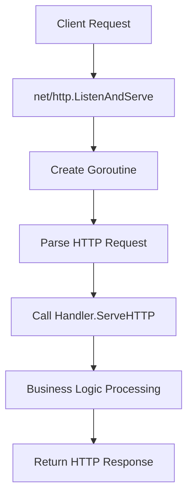
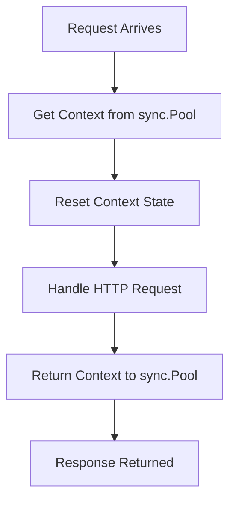
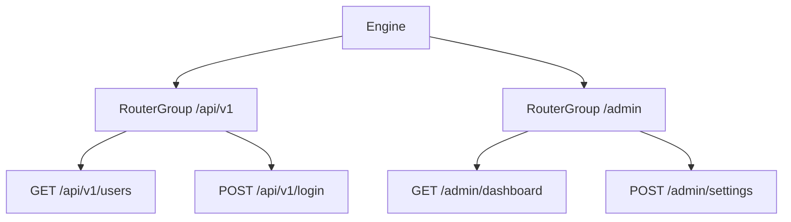
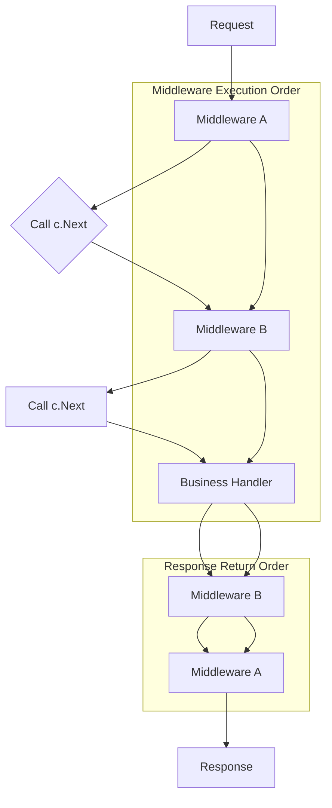

+++
title = "Gin Framework Internals: A Deep Dive into High-Performance Go Web Services"
description = "An in-depth analysis of the Go Gin web framework's core architecture, from the basics of net/http to the implementation of Engine, routing, middleware, and sync.Pool, to understand the underlying design of Gin's high performance."
keywords = ["Go", "Golang", "Gin", "Gin framework", "Gin internals", "Gin architecture", "Go web framework", "Gin performance", "net/http", "sync.Pool", "Gin middleware", "Gin routing", "Radix tree"]
date = 2025-08-10T17:15:02+08:00
authors = ["muzhy"]
tags = ["Go", "Gin"]
categories = ["Go/Gin"]
cover = "/images/gin.webp"
draft = false
+++

Gin is an HTTP web framework written in Go (Golang). It features a concise architecture, and thanks to Go's `net/http` package, it abstracts away the low-level details of the HTTP protocol, allowing developers to focus on application logic.

# Overview of the `net/http` Package
Since Gin is built on `net/http`, let's first get a brief understanding of `net/http`.

The `net/http` package provides both HTTP client and server functionalities. Here, we'll focus on the server-side features.
## Core Server Design
Thanks to Go's concurrency model, we don't need to worry about I/O multiplexing mechanisms like the traditional Reactor or Proactor patterns. Instead, a separate `goroutine` is created for each incoming request. (If you're interested in this part, you can look into Go's scheduler and goroutines).

The core of `net/http`'s server-side design is the `http.Handler` interface:
```go
type Handler interface{
	ServeHTTP(ResponseWriter, *Request)
}
```
Any type that implements this interface can act as an HTTP request handler. The `ServeHTTP` method accepts an `http.ResponseWriter` and an `*http.Request`, which are used for writing the response and reading request information, respectively.

This design completely decouples business logic from the underlying network details, allowing developers to focus solely on how to handle requests and generate responses.
## Process Flow
You can start an HTTP server with `net/http` by calling `ListenAndServe` to listen on a port.

Here's a simple example of starting an HTTP server with `net/http`:
```go
func main() {
    http.Handle("/foo", fooHandler)

	http.HandleFunc("/bar", func(w http.ResponseWriter, r *http.Request) {
		fmt.Fprintf(w, "Hello, %q", html.EscapeString(r.URL.Path))
	})

	log.Fatal(http.ListenAndServe(":8080", nil))
}
```
> ListenAndServe starts an HTTP server with a given address and handler. The handler is usually nil, which means to use DefaultServeMux. Handle and HandleFunc add handlers to DefaultServeMux.

Here is a diagram of the processing flow:



The `http.ListenAndServe` function:
```go
// ListenAndServe listens on the TCP network address addr and then calls
// [Serve] with handler to handle requests on incoming connections.
// Accepted connections are configured to enable TCP keep-alives.
//
// The handler is typically nil, in which case [DefaultServeMux] is used.
//
// ListenAndServe always returns a non-nil error.
func ListenAndServe(addr string, handler Handler) error {
    server := &Server{Addr: addr, Handler: handler}
    return server.ListenAndServe()
}
```
The second parameter of `ListenAndServe` accepts a type that implements the `http.Handler` interface. The default `DefaultServeMux` is one such type, and Gin's `Engine` is another.
`DefaultServeMux`:
```go
// Handler returns the handler to use for the given request,
// consulting r.Method, r.Host, and r.URL.Path. It always returns
// a non-nil handler. If the path is not in its canonical form, the
// handler will be an internally-generated handler that redirects
// to the canonical path. If the host contains a port, it is ignored
// when matching handlers.
//
// The path and host are used unchanged for CONNECT requests.
//
// Handler also returns the registered pattern that matches the
// request or, in the case of internally-generated redirects,
// the path that will match after following the redirect.
//
// If there is no registered handler that applies to the request,
// Handler returns a “page not found” handler and an empty pattern.
func (mux *ServeMux) Handler(r *Request) (h Handler, pattern string) {
	if use121 {
		return mux.mux121.findHandler(r)
	}
	h, p, _, _ := mux.findHandler(r)
	return h, p
}
```

## Summary
To recap, `net/http` starts an HTTP server with `ListenAndServe`, listening on a specified port. When a request arrives, it launches a goroutine to handle it (`net/http/server.go`). After parsing the HTTP request, it calls the `Handler.ServeHTTP` method for processing. This method can be customized by implementing the `Handler` interface and set when calling `ListenAndServe`.

# `Engine`: The Core of Gin
As mentioned, Gin works by implementing the `http.Handler` interface. In Gin, the type that implements this interface is the `Engine`. Therefore, starting with the `Engine` is a good way to understand Gin's structure.
## ServeHTTP
When `net/http` receives a request, it creates a goroutine to handle it. After reading and parsing the data, it calls `ServeHTTP`.
```go
func (sh serverHandler) ServeHTTP(rw ResponseWriter, req *Request) {
	handler := sh.srv.Handler
	if handler == nil {
		handler = DefaultServeMux
	}
	if !sh.srv.DisableGeneralOptionsHandler && req.RequestURI == "*" && req.Method == "OPTIONS" {
		handler = globalOptionsHandler{}
	}

	handler.ServeHTTP(rw, req)
}
```
The `ServeHTTP` processing flow:

The implementation of `Engine`'s `ServeHTTP` is as follows:
```go
// ServeHTTP conforms to the http.Handler interface.
func (engine *Engine) ServeHTTP(w http.ResponseWriter, req *http.Request) {
	c := engine.pool.Get().(*Context)
	c.writermem.reset(w)
	c.Request = req
	c.reset()

	engine.handleHTTPRequest(c)

	engine.pool.Put(c)
}

```

For each request, Gin allocates a `gin.Context` object to manage the request's context. To avoid frequent creation and destruction of `gin.Context` objects, `engine.pool` is used to cache them. When a request arrives, a `gin.Context` object is retrieved from the pool and its state is reset. This `gin.Context` is then passed down the processing chain. After the request is handled, the `gin.Context` is returned to the object pool.

After obtaining a `gin.Context`, the request is handled by `handleHTTPRequest`. This function first determines the route based on the URL and retrieves all handlers (i.e., middleware) bound to that route path. These middleware form a processing chain, and the handlers in the chain are executed sequentially.

## A Look at `sync.Pool`
`engine.pool` is of type `sync.Pool`, a thread-safe object pool that provides `Get()` and `Put()` methods, allowing it to be used concurrently by multiple goroutines. Its internal design prioritizes local goroutine caches to reduce lock contention (each goroutine has a private local cache). When `Get()` is called, it first tries to retrieve from the local cache, and only if the local cache is empty does it access the shared pool. `Put()` also prioritizes returning objects to the local cache.

**Why reset `gin.Context`?**
`sync.Pool` is not suitable for storing objects that are stateful and cannot be reset. `gin.Context` is a typical example; it stores request-related state, such as the `Request`, `ResponseWriter`, and `Keys` passed between middleware. If not reset, the next request might use stale data from the previous one, leading to logical errors.

Gin solves this by calling `c.reset()` in the `ServeHTTP` method. The `reset` method restores the `Context`'s state (like `Request`, `ResponseWriter`, `Keys`, `index`, etc.) to its initial state, ensuring each request gets a clean context.

# Routing and Middleware
The core of Gin consists of the `Engine` and `RouterGroup`. In fact, `Engine` embeds `RouterGroup`, making it a `RouterGroup` itself.
```go
// Engine is the framework's instance, it contains the muxer, middleware and configuration settings.
// Create an instance of Engine, by using New() or Default()
type Engine struct {
	RouterGroup
	...
}
```

Gin's routes are stored in a Radix Tree. The `Engine` is the root `RouterGroup`.
```go
// RouterGroup is used internally to configure router, a RouterGroup is associated with
// a prefix and an array of handlers (middleware).
type RouterGroup struct {
	Handlers HandlersChain
	basePath string
	engine   *Engine
	root     bool
}
```
`Handlers` stores the middleware registered at this level.
`basePath` manages the prefix path for the route group, facilitating route organization.

Gin's routes are stored in a Radix Tree, a data structure that enables efficient dynamic route matching.


When you register a route with methods like `GET`, `POST`, etc., Gin performs the following steps to generate the complete handler chain:
1.  **Get Parent Middleware**: It first retrieves the `Handlers` slice from the current `RouterGroup` (or `Engine`).
2.  **Append Handlers**: It then appends the route handler functions (`handler...`) for this registration to the end of that slice.
3.  **Store in Radix Tree**: Finally, this complete handler chain is stored as a whole, along with the request method and route path, in Gin's routing tree (a Radix Tree).

### Advantages of the Routing Mechanism

Using a Radix Tree as the core of route matching offers several benefits:
- **Efficient Matching**: It can quickly locate the matching route, especially when the number of routes is large.
- **Dynamic Route Support**: It easily handles routes with parameters, like `/users/:id`.
- **Wildcard Support**: It can handle wildcard routes, such as `/static/*filepath`.


# `Context` 
The `gin.Context` persists throughout the entire HTTP request lifecycle. Besides storing data for communication between different middleware, the context object also provides many methods to facilitate data parsing and response generation, as well as `Next()` and `Abort()` for flow control.

## Passing Data
`gin.Context` uses a `map[string]any` to store data and provides `Set` and `Get` methods to access it.
```go
type Context struct {
	...
	// Keys is a key/value pair exclusively for the context of the request.
	// New objects are not accepted.
	Keys map[string]any
	...
}
```
## Wrapping the Current Request and Response
```go
	c.writermem.reset(w)
	c.Request = req
```
From the `ServeHTTP` implementation above, you can see that the `http.ResponseWriter` and `*http.Request` passed from `net/http` are stored in the `gin.Context`.
`gin.Context` provides many convenient methods for retrieving request data and returning responses, eliminating the need to directly manipulate `http.ResponseWriter` and `*http.Request`.

When reading data, for example, using `c.ShouldBindJSON(data)`, its implementation needs to use `*http.Request` to parse the data:
```go
// Binding describes the interface which needs to be implemented for binding the
// data present in the request such as JSON request body, query parameters or
// the form POST.
type Binding interface {
	Name() string
	Bind(*http.Request, any) error
}
// --- binding/json.go
func (jsonBinding) Bind(req *http.Request, obj any) error {
	if req == nil || req.Body == nil {
		return errors.New("invalid request")
	}
	return decodeJSON(req.Body, obj)
}
```

To return a JSON-formatted response, you can call `c.JSON()` to format the object into JSON.
Gin uses `Render` to format data. The `Render` interface is defined as:
```go
// Render interface is to be implemented by JSON, XML, HTML, YAML and so on.
type Render interface {
	// Render writes data with custom ContentType.
	Render(http.ResponseWriter) error
	// WriteContentType writes custom ContentType.
	WriteContentType(w http.ResponseWriter)
}
```
The `Render` method is responsible for formatting the data and writing it to the `http.ResponseWriter`.
The JSON `Render`:
```go
// Render (JSON) writes data with custom ContentType.
func (r JSON) Render(w http.ResponseWriter) error {
	return WriteJSON(w, r.Data)
}

// WriteJSON marshals the given interface object and writes it with custom ContentType.
func WriteJSON(w http.ResponseWriter, obj any) error {
	writeContentType(w, jsonContentType)
	jsonBytes, err := json.Marshal(obj)
	if err != nil {
		return err
	}
	_, err = w.Write(jsonBytes)
	return err
}
```
## Flow Control
When a request arrives, it is routed based on the `url`. The `handlers` from the matched route node are saved to the `handlers` property of the `Context`:
```go
type Context struct {
...
	handlers HandlersChain
	index    int8
...
}

// HandlersChain defines a HandlerFunc slice.
type HandlersChain []HandlerFunc
```
The `Next()` method simply proceeds down the handler chain:
```go
// Next should be used only inside middleware.
// It executes the pending handlers in the chain inside the calling handler.
// See example in GitHub.
func (c *Context) Next() {
	c.index++
	for c.index < int8(len(c.handlers)) {
		c.handlers[c.index](c)
		c.index++
	}
}
```

Middleware processing flow diagram:


`Abort()` terminates the entire call chain by setting `index` to `math.MaxInt8 >> 1`:
```go
// abortIndex represents a typical value used in abort functions.
const abortIndex int8 = math.MaxInt8 >> 1

// Abort prevents pending handlers from being called. Note that this will not stop the current handler.
// Let's say you have an authorization middleware that validates that the current request is authorized.
// If the authorization fails (ex: the password does not match), call Abort to ensure the remaining handlers
// for this request are not called.
func (c *Context) Abort() {
	c.index = abortIndex
}
```


# Conclusion
The Gin framework achieves a concise and efficient web service through the following core mechanisms:
- **Built on `net/http`**: It leverages the `Handler` interface and concurrency model to decouple network details from business logic.
- **`Engine` and `sync.Pool`**: The `Engine` acts as the core processor, and an object pool is used to efficiently manage `gin.Context` objects.
- **`Radix Tree` Routing**: Implements high-performance request matching that supports dynamic routes.
- **`Context` Object**: Persists through the request lifecycle, encapsulates the request and response, and provides flow control and data passing capabilities.
- **Middleware Mechanism**: Achieves a flexible request processing pipeline through `HandlersChain`, `Next()`, and `Abort()`.

Together, these designs form Gin's simple yet powerful architecture, making it a popular choice for web development in Go.
