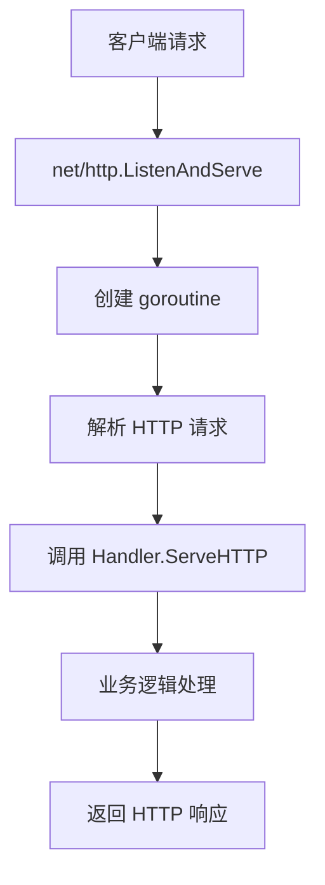
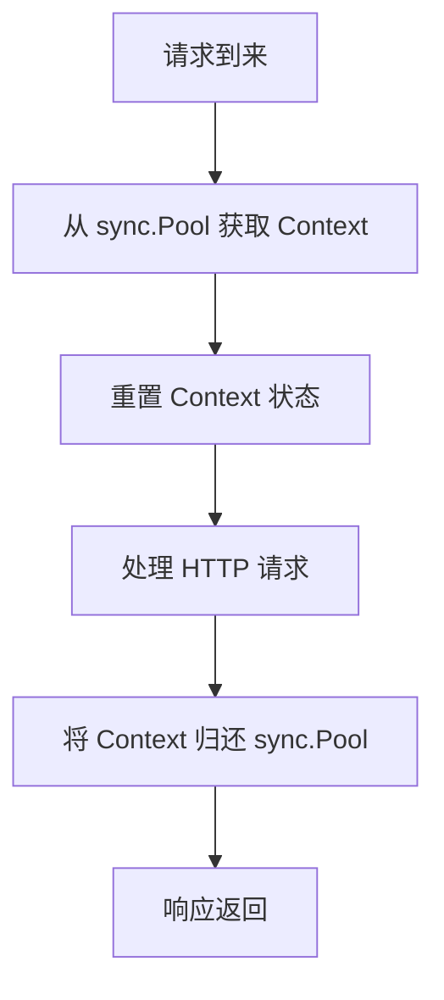
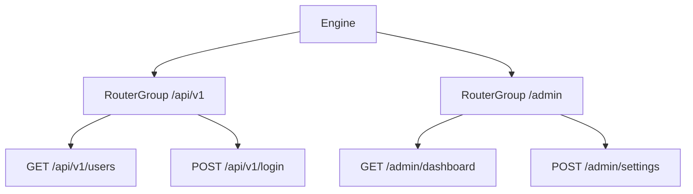
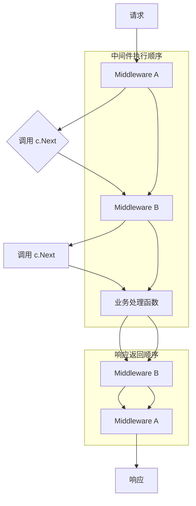

+++
title = "Gin 框架核心架构解析"
description = "深入分析 Go 语言 Gin Web 框架的核心架构，从 net/http 基础到 Engine、路由、中间件和 sync.Pool 的实现原理，理解 Gin 高性能的底层设计。"
keywords = ["Go", "Gin", "Gin框架", "Gin源码解析", "Gin底层原理", "net/http", "sync.Pool", "中间件"]
date = 2025-08-10T17:15:02+08:00
authors = ["木章永"]
tags = ["Go", "Gin"]
categories = ["GO/Gin"]
cover = "/images/gin.webp"
draft = false
+++

Gin 是一个用Go (Golang) 编写的HTTP Web 框架，架构非常简洁，得益于Go的`net/http`库，不用处理`http`协议底层细节，可以更好的聚焦于应用层逻辑

# `net/http`库概览
`Gin`是基于`net/http`实现的， 在介绍`Gin`之前，不妨先了解下[`net/http`](https://pkg.go.dev/net/http)

`net/http`提供了HTTP客户端和服务端的功能，这里主要关心服务端的功能
## 服务端核心设计
得益于Go的并发模型，这里并不需要关心像传统处理网络请求的`Reactor`或`Proactor`的I/O复用机制，而是为每个请求都创建一个独立的`goroutine`来处理（对这部分有兴趣可以了解下Go的调度器和goroutine）。

`net/http`服务端功能的核心设计是`http.Hander`接口
```go
type Handler interface{
	ServeHTTP(ResponseWriter, *Request)
}
```
任何实现了这个接口的类型都可以作为一个HTTP请求处理器。`ServeHTTP` 方法接收一个 `http.ResponseWriter` 和一个 `*http.Request`，分别用于写入响应和读取请求信息。

这种设计将业务逻辑与底层的网络细节彻底解耦，开发者只需关注如何处理请求和生成响应即可。
## 流程说明
`net/http`可以通过调用`ListenAndServe`监听端口，启动HTTP服务

使用`net/http`启动HTTP服务的简单示例：
```go
func main() {
    http.Handle("/foo", fooHandler)

	http.HandleFunc("/bar", func(w http.ResponseWriter, r *http.Request) {
		fmt.Fprintf(w, "Hello, %q", html.EscapeString(r.URL.Path))
	})

	log.Fatal(http.ListenAndServe(":8080", nil))
}
```
>ListenAndServe starts an HTTP server with a given address and handler. The handler is usually nil, which means to use [DefaultServeMux](https://pkg.go.dev/net/http#DefaultServeMux). [Handle](https://pkg.go.dev/net/http#Handle) and [HandleFunc](https://pkg.go.dev/net/http#HandleFunc) add handlers to [DefaultServeMux](https://pkg.go.dev/net/http#DefaultServeMux)

流程处理示意图：



`http.ListenAndServe`
```go
// ListenAndServe listens on the TCP network address addr and then calls
// [Serve] with handler to handle requests on incoming connections.
// Accepted connections are configured to enable TCP keep-alives.
//
// The handler is typically nil, in which case [DefaultServeMux] is used.
//
// ListenAndServe always returns a non-nil error.
func ListenAndServe(addr string, handler Handler) error {
    server := &Server{Addr: addr, Handler: handler}
    return server.ListenAndServe()
}
```
`ListenAndServe`的第二个参数接收的就是前面说的实现了`http.Handler`接口的类型，默认的`DefaultServeMux`也是实现了该接口的一个类型，Gin的`Engine`也是一个实现了`http.Handler`的类型
`DefaultServeMux`：
```go
// Handler returns the handler to use for the given request,
// consulting r.Method, r.Host, and r.URL.Path. It always returns
// a non-nil handler. If the path is not in its canonical form, the
// handler will be an internally-generated handler that redirects
// to the canonical path. If the host contains a port, it is ignored
// when matching handlers.
//
// The path and host are used unchanged for CONNECT requests.
//
// Handler also returns the registered pattern that matches the
// request or, in the case of internally-generated redirects,
// the path that will match after following the redirect.
//
// If there is no registered handler that applies to the request,
// Handler returns a “page not found” handler and an empty pattern.
func (mux *ServeMux) Handler(r *Request) (h Handler, pattern string) {
	if use121 {
		return mux.mux121.findHandler(r)
	}
	h, p, _, _ := mux.findHandler(r)
	return h, p
}
```

## 总结
简单的回顾下，`net/http`通过`ListenAndServe`启动HTTP服务，监听指定的端口，当有请求到达时，启动一个goroutine来处理该请求（`net/http/server.go`），在完成HTTP的解析后，会调用`Handler.ServeHTTP`方法进行处理，该方法可以通过实现`Handler`接口来自定义，并在调用`ListenAndServe`时进行设置。

# `Engine`: Gin的核心
上面已经说了，Gin是通过实现`http.Handler`接口实现的，在Gin中实现这个接口的就是`Engine`，所以要了解Gin的结构从`Engine`入手是比较方便的。
## ServeHttp
`net/http`在接收到一个请求后，会创建一个goroutine处理该请求，在读取数据并进行解析后，会调用`ServeHttp`
```go
func (sh serverHandler) ServeHTTP(rw ResponseWriter, req *Request) {
	handler := sh.srv.Handler
	if handler == nil {
		handler = DefaultServeMux
	}
	if !sh.srv.DisableGeneralOptionsHandler && req.RequestURI == "*" && req.Method == "OPTIONS" {
		handler = globalOptionsHandler{}
	}

	handler.ServeHTTP(rw, req)
}
```
`ServeHttp`处理流程

`Engine`的`ServeHttp`的实现为：
```go
// ServeHTTP conforms to the http.Handler interface.
func (engine *Engine) ServeHTTP(w http.ResponseWriter, req *http.Request) {
	c := engine.pool.Get().(*Context)
	c.writermem.reset(w)
	c.Request = req
	c.reset()

	engine.handleHTTPRequest(c)

	engine.pool.Put(c)
}

```

在处理每个请求时，Gin都会为该请求分配一个`gin.Context`对象用来管理请求的上下文。为了避免频繁的创建和销毁`gin.Context`，使用了`engine.pool`来缓存`gin.Context`对象，每个请求到达时，先从`pool`中获取一个`gin.Context`对象，并重置`gin.Context`的状态，之后将`gin.Context`传递下去，请求处理完成后再将`gin.Context`返回对象池中。

在获取到`gin.Context`之后，通过`HandleHttpRequest`处理请求，`HandleHttpRequest`先根据URL确定路由，并获取绑定到路由路径上的所有`handle`，也就是`middleWare`，这些`middleWare`组成一个处理链，之后依次执行链上的`handle`

## `sync.pool` 解析
`engine.pool`的类型是`sync.Pool`，是一个线程安全的对象池，提供了`Get()`和`Put()`方法，可以在多个goroutine中同时使用。
其内部设计优先考虑本地goroutine缓存以减少锁竞争（每个goroutine都有一个私有的本地缓存），当 `Get()` 时会首先从本地缓存获取，本地没有再从共享池中获取，`Put()` 时也优先放回本地缓存。

**为什么要重置`gin.Context`?**
`sync.Pool`不适合存放有状态且不能被重置的对象。`gin.Context`就是一个典型的例子，它会存储请求相关的状态，例如`Request`、`ResponseWriter`以及在中间件中传递的`Keys`。如果不重置，下一个请求可能会使用到上一个请求的残留数据，导致逻辑错误。

Gin通过在`ServeHTTP`方法中调用`c.reset()`来解决这个问题。`reset`方法会将`Context`的状态（如`Request`、`ResponseWriter`、`Keys`、`index`等）恢复到初始状态，确保每个请求都能获得一个干净的上下文。

# 路由 和中间件
Gin的核心是`Engine`和`RouterGroup`，实际上，`Engine`嵌入了`RouterGroup`，也是一个`RouterGroup`
```go
// Engine is the framework's instance, it contains the muxer, middleware and configuration settings.
// Create an instance of Engine, by using New() or Default()
type Engine struct {
	RouterGroup
	...
}
```

Gin中的路由通过前缀树(`Radix Tree`)进行保存， `Engine`就是根`RouterGroup`
```go
// RouterGroup is used internally to configure router, a RouterGroup is associated with
// a prefix and an array of handlers (middleware).
type RouterGroup struct {
	Handlers HandlersChain
	basePath string
	engine   *Engine
	root     bool
}
```
`Handlers` 存储了该层级注册的中间件
`basePath` 用于管理路由组的前缀路径，方便路由组织

Gin中的路由通过前缀树（`Radix Tree`）进行保存，这种数据结构能够高效地进行动态路由匹配。


当你在 `GET`, `POST` 等方法中注册一个路由时，Gin 会执行以下步骤来生成完整的处理链：
1. **获取父级中间件**：首先，它会从当前的 `RouterGroup`（或 `Engine`）中获取其 `Handlers` 切片。    
2. **拼接处理函数**：然后，它会将本次注册的路由处理函数（`handler...`）追加到这个切片的末尾。    
3. **存储到路由树**：最终，这个完整的处理链会作为一个整体，与请求方法和路由路径一起，存储到 Gin 的路由树（一个前缀树 `Radix Tree`）中。

### 路由机制的优势

使用`Radix Tree`作为路由匹配的核心，带来了以下好处：
- **高效匹配**：能快速定位到匹配的路由，尤其是在路由数量庞大时。    
- **支持动态路由**：可以轻松处理`/users/:id`这类带有参数的路由。    
- **支持通配符**：可以处理`/static/*filepath`这类通配符路由。


# `Context` 
`gin.Context`贯穿整个HTTP请求生命周期，上下文对象除了保存数据用于在不同的中间件之间传递数据外，还提供了许多方法方便解析数据和响应数据，以及提供`Next()`和`Abort()`来控制流程

## 传递数据
`gin.Context`通过一个`map[string]any`对象来保存数据，并提供了`Set`和`Get`方法存取其中的数据
```go
type Context struct {
	...
	// Keys is a key/value pair exclusively for the context of the request.
	// New objects are not accepted.
	Keys map[string]any
	...
}
```
## 封装当前请求和响应
```go
	c.writermem.reset(w)
	c.Request = req
```
上面`ServeHTTP`的实现中可以看到，会将`net/http`传递过来的`http.ResponseWriter`和`*http.Request` 保存到`gin.Context`中。
`gin.Context`提供和许多方法方便获取请求数据和返回响应，而不用直接操作`http.ResponseWriter`和`*http.Request`。

在读取数据时，如使用`c.ShouldBindJSON(data)`获取数据时，其实现就需要用到`*http.Request`解析数据：
```go
// Binding describes the interface which needs to be implemented for binding the
// data present in the request such as JSON request body, query parameters or
// the form POST.
type Binding interface {
	Name() string
	Bind(*http.Request, any) error
}
// --- binding/json.go
func (jsonBinding) Bind(req *http.Request, obj any) error {
	if req == nil || req.Body == nil {
		return errors.New("invalid request")
	}
	return decodeJSON(req.Body, obj)
}
```

要返回JSON格式的响应数据，则可以调用`c.JSON()`将对象格式化为JSON格式。
Gin使用`Render`来格式化数据，`Render`的接口定义为：
```go
// Render interface is to be implemented by JSON, XML, HTML, YAML and so on.
type Render interface {
	// Render writes data with custom ContentType.
	Render(http.ResponseWriter) error
	// WriteContentType writes custom ContentType.
	WriteContentType(w http.ResponseWriter)
}
```
其中的`Render`方法负责将数据格式化并写到`http.ResponseWriter`中
JSON的Render：
```go
// Render (JSON) writes data with custom ContentType.
func (r JSON) Render(w http.ResponseWriter) error {
	return WriteJSON(w, r.Data)
}

// WriteJSON marshals the given interface object and writes it with custom ContentType.
func WriteJSON(w http.ResponseWriter, obj any) error {
	writeContentType(w, jsonContentType)
	jsonBytes, err := json.Marshal(obj)
	if err != nil {
		return err
	}
	_, err = w.Write(jsonBytes)
	return err
}
```
## 流程控制
请求到达后，会根据`url`进行路由，将匹配到的路由节点中的`handlers`的函数处理链保存到`Context`中的`handlers`属性中：
```go
type Context struct {
...
	handlers HandlersChain
	index    int8
...
}

// HandlersChain defines a HandlerFunc slice.
type HandlersChain []HandlerFunc
```
`Next()`方法实际上只是沿着函数处理链往下走：
```go
// Next should be used only inside middleware.
// It executes the pending handlers in the chain inside the calling handler.
// See example in GitHub.
func (c *Context) Next() {
	c.index++
	for c.index < int8(len(c.handlers)) {
		c.handlers[c.index](c)
		c.index++
	}
}
```

中间件处理流程示意图：


`Abort()`将`index`设置为`math.MaxInt8 >> 1`来终止整个调用链：
```go
// abortIndex represents a typical value used in abort functions.
const abortIndex int8 = math.MaxInt8 >> 1

// Abort prevents pending handlers from being called. Note that this will not stop the current handler.
// Let's say you have an authorization middleware that validates that the current request is authorized.
// If the authorization fails (ex: the password does not match), call Abort to ensure the remaining handlers
// for this request are not called.
func (c *Context) Abort() {
	c.index = abortIndex

```


# 总结
Gin框架通过以下核心机制实现了简洁高效的Web服务：
- **基于`net/http`**：利用其`Handler`接口和并发模型，解耦了网络细节和业务逻辑。    
- **`Engine`和`sync.Pool`**：通过`Engine`作为核心处理器，并使用对象池高效管理`gin.Context`对象。    
- **`Radix Tree`路由**：实现了高性能、支持动态路由的请求匹配。    
- **`Context`对象**：贯穿请求生命周期，封装了请求和响应，提供了流程控制和数据传递能力。    
- **中间件机制**：通过`HandlersChain`和`Next()`、`Abort()`实现了灵活的请求处理管道。    

这些设计共同构成了Gin简洁而强大的架构，使其成为Go语言Web开发中的热门选择。